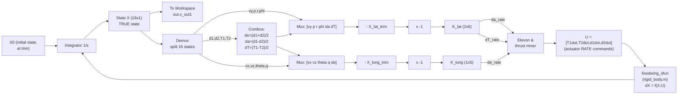
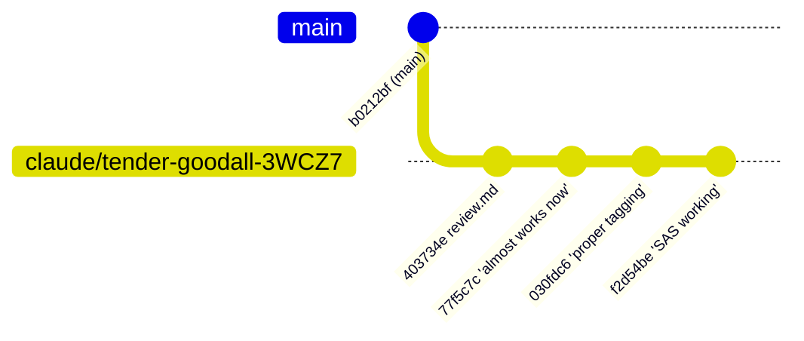
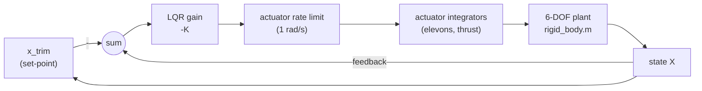
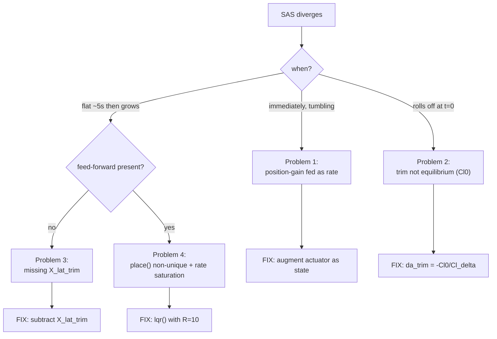
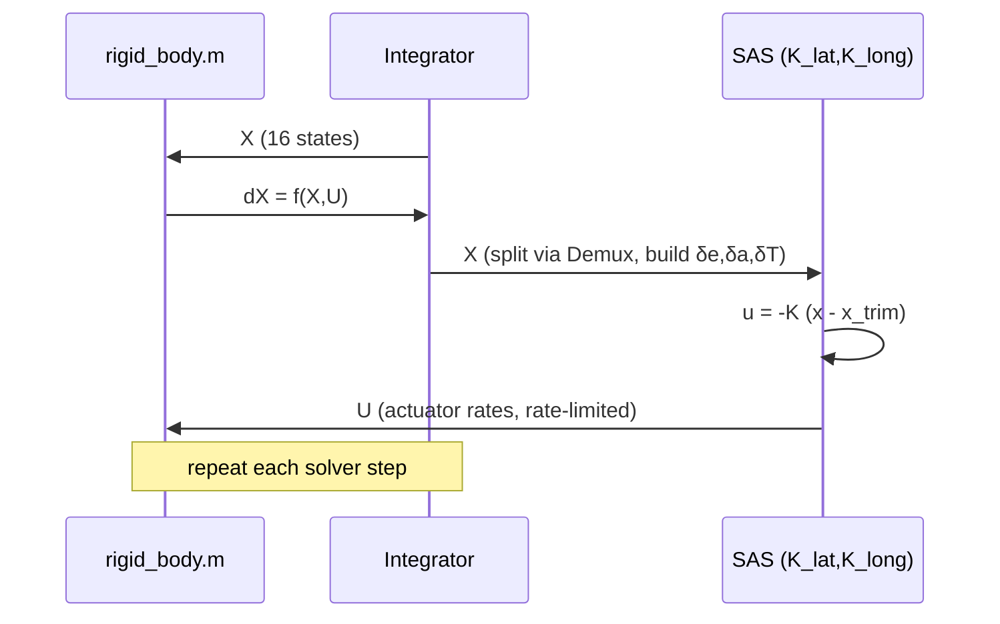

# SYSTEM DEEP DIVE — branch `claude/tender-goodall-3WCZ7`

> **Repository:** `ManiKaarthik0/TailsitterGNC`
> **Branch analysed:** `claude/tender-goodall-3WCZ7` (HEAD `f2d54be` — *"SAS working"*)
> **Base branch:** `main` (merge-base `b0212bf`, *"Merge pull request #1 from ManiKaarthik0/firstMerge"*)
> **Generated:** automated deep-dive from repository evidence (code, diff, commit history, Simulink model contents, and the recorded debugging session).

**Evidence tags used throughout this document:**
- **[E]** *Directly evidenced* — taken straight from a file, a diff line, a commit message, or a numeric result computed from the repo.
- **[S]** *Strongly suggested* — not stated verbatim, but the code/diff/history points clearly to it.
- **[U]** *Uncertain / inference* — the most reasonable interpretation given the evidence, explicitly flagged as such.

---

# 1. Executive Summary

**What the system is.** This repository builds the **Guidance, Navigation, and Control (GNC)** software for a small (2.5 kg) fixed‑wing‑style air vehicle, simulated in **MATLAB/Simulink**. Although the project is named *Tailsitter*, every model in the repo describes a **conventional fixed‑wing aircraft in forward cruise at 20 m/s** — there is no hover, no vertical take‑off, and no transition logic. **[E]** (state layout in `dynamics/rigid_body.m`, trim at `V0 = 20` in `sim/linearize_trim.m`).

The vehicle is modelled with **16 states** and full **6‑degree‑of‑freedom (6‑DOF)** rigid‑body dynamics. On top of the plant, the project adds:
- a **Stability Augmentation System (SAS)** — an inner‑loop controller that keeps the aircraft steady; and
- the beginnings of an **attitude estimator** (an IMU sensor model + an Extended Kalman Filter), which is **not yet correct or integrated**. **[E]**

**What this branch changes.** Compared to `main`, the branch:
1. adds a long engineering review (`GNC_TECHNICAL_REVIEW.md`, 552 lines) **[E]**;
2. **completely reworks `sim/linearize_trim.m`** (≈260 lines changed) to design a *correct, robust* SAS **[E]**; and
3. updates the two Simulink models (`closed_loop_sim.slx`, `closed_loop_sim_est.slx`) to wire that SAS into the simulation **[E]**.

The vehicle dynamics (`dynamics/`) and parameters (`params/params.m`) are **byte‑identical to `main`** — confirmed by `git diff` showing only `sim/linearize_trim.m` changed under the code directories. **[E]** So the entire engineering story of this branch lives in the **control design** and **its simulation wiring**.

**Current state.** The **SAS works** — the closed loop holds trim and damps perturbations, confirmed both in a standalone MATLAB integration and in Simulink, and recorded in the commit message progression *"it almost works now"* → *"SAS working."* **[E]** The **estimator (EKF/IMU) is documented but unfixed**: it still has a known Jacobian sign error, no gyro‑bias state, an unobservable yaw channel, and an unsafe continuous‑time noise setup. **[E]** (all catalogued in `GNC_TECHNICAL_REVIEW.md`).

**The most important development challenges** (all reconstructed from the diff, the model, and the debugging trace) were, in order:
1. **A controller designed for the wrong input.** Gains were derived assuming the control was an actuator *position*, but the plant accepts actuator *rates* — an extra integrator the design ignored. **[E]**
2. **A trim point that was not an equilibrium.** A nonzero roll coefficient (`Cl0`) produced a constant 7.14 rad/s² roll acceleration at the supposed trim. **[E]**
3. **A missing feed‑forward of the lateral trim**, which let the controller slowly undo the trim and diverge after ~6 s. **[E]**
4. **A non‑unique pole‑placement gain that violated the actuator rate limit**, causing saturation‑driven divergence. **[E]**

**Key lessons learned.**
- A model that is *linearly* stable can still **diverge in reality** if it ignores actuator limits.
- For multi‑input systems, `place()` is a **coin‑flip on robustness**; `lqr()` gives a unique, effort‑aware gain.
- **Always verify the trim is a true equilibrium** before you linearise around it.
- **Design on the same model you implement** — if the real input is a rate, the actuator must be a state in the design model.

---

# 2. What the System Is

## 2.1 Simple intuition (plain English first)

Imagine you are flying a foam model airplane. Three things have to happen, continuously and automatically, for it to fly well:

1. **Navigation** — *"Where am I, and which way am I pointed?"* The aircraft has tiny electronic sensors (a gyroscope and an accelerometer, together an *IMU*) that are noisy. Software has to turn those noisy readings into a clean estimate of the airplane's attitude (its roll/pitch/yaw angles). That software is an **estimator** (here, an *Extended Kalman Filter*).

2. **Guidance** — *"Where do I want to go?"* (This part does not exist yet in the repo.)

3. **Control** — *"What should I do with the control surfaces and motors to stay steady / go where I want?"* The little flaps on the wing (here, *elevons*) and the motor thrust must be nudged constantly. The piece that keeps the plane from wobbling or tumbling is the **Stability Augmentation System (SAS)**.

This repository is mostly a **flight simulator + the control and estimation brains** for such an aircraft. You don't fly a real plane to test ideas; you fly a *math model* of the plane inside MATLAB/Simulink and check that your control laws keep it stable.

**Analogy.** Think of **balancing a broomstick on your palm**. Your eyes (sensors) tell you the stick is tipping; your brain (estimator) figures out *how fast and which way*; your hand (controller) moves to catch it. The SAS is the reflex that keeps the stick from falling. This project builds the "eyes," the "brain," and the "hand" — in software, for an airplane.

## 2.2 Technical description

| Aspect | What the repo shows | Evidence |
|---|---|---|
| **System type** | A **hybrid**: a continuous‑time **plant model** (6‑DOF nonlinear dynamics) + a **controller** (SAS) + a partially‑built **estimator** (EKF), all run inside Simulink and MATLAB scripts. | **[E]** `dynamics/`, `sim/`, `.slx` |
| **Vehicle** | Named "tailsitter," but modelled as a **fixed‑wing aircraft in cruise**. Mass 2.5 kg, wingspan 1.0 m, wing area 0.26 m². | **[E]** `params/params.m` |
| **Domain** | Aerospace GNC / flight dynamics & control. | **[S]** |
| **Operating point** | Steady level flight at **V₀ = 20 m/s**, trim angle of attack ≈ **6.55°** (0.114 rad). | **[E]** `linearize_trim.m`; computed |

**Main inputs, outputs, states, feedback loops:**

- **Plant state** `X` (16 elements) **[E]** (`rigid_body.m` line 3):
  ```
  X = [ x  y  z  | ψ  φ  θ | vx vy vz | wx wy wz | T1 T2 | d1 d2 ]
        position  attitude   body vel    body rate  thrust  elevons
        (NED, m)  (rad,ZXY)   (m/s)       (rad/s)    (N)     (rad)
  ```
- **Plant input** `U` (4 elements) — these are **rates**, not positions **[E]** (`params.m` line 58):
  ```
  U = [ T1dot  T2dot  d1dot  d2dot ]   (actuator rate commands)
  ```
- **Controller output** → `U`. **Controller input** → the state `X` (currently the *true* state; eventually the *estimated* state). This is the **feedback loop**: state → controller → actuator rates → plant → new state.
- **Sensors** (estimator side): IMU produces noisy `z_gyro` (3) and `z_accel` (3); the EKF turns them into an attitude estimate `X_est` (6).

So the system is a **closed loop**: the plant produces a state, the controller reacts to it, and the loop repeats — exactly like the broomstick reflex, running at simulation speed.

---

# 3. How the System Is Designed

## 3.1 Major components and the files that implement them

| Layer | File | Role | Interactions |
|---|---|---|---|
| **Parameters** | `params/params.m` | Mass, inertia, geometry, all aerodynamic coefficients, actuator limits, state layout comments. The single source of physical truth. | Loaded by every script; packed into a struct `P`. **[E]** |
| **Plant (dynamics)** | `dynamics/rigid_body.m` | The heart: given state `X`, input `U`, params `P`, returns the 16‑element state derivative `dX`. Full 6‑DOF equations of motion. | Called by `ode45`, by the finite‑difference linearizer, and (wrapped) by Simulink. **[E]** |
| | `dynamics/aero_forces.m` | Aerodynamic forces & moments, with stall blending and propwash. | Called by `rigid_body.m`. **[E]** |
| | `dynamics/aero_angles.m` | Computes angle of attack α and sideslip β from body velocity. | Called by `rigid_body.m`. **[E]** |
| | `dynamics/rot_matrix.m` | Body→world rotation matrix, **ZXY** Euler convention. | Called by `rigid_body.m` for position kinematics. **[E]** |
| | `dynamics/elevon_mix.m` | Mixes the two elevon deflections into "elevator" (pitch) and "aileron" (roll) commands. | Called by `rigid_body.m`. **[E]** |
| **Sensor model** | `dynamics/imu_simulate.m` | Fake IMU: gyro + accelerometer with noise and a constant bias. | Called by `imu_sfun.m` in Simulink and `test_ekf.m`. **[E]** |
| **Estimator** | `dynamics/ekf_attitude.m` | 6‑state attitude Extended Kalman Filter. | Called by `ekf_sfun.m` and `test_ekf.m`. **[E]** |
| **Simulink wrappers** | `dynamics/fixedwing_sfun.m` | Level‑2 S‑function wrapping `rigid_body.m` so Simulink can use it. | Plant block in the `.slx` models. **[E]** |
| | `dynamics/imu_sfun.m`, `ekf_sfun.m` | Wrap the IMU and EKF for Simulink. | Sensor/estimator blocks. **[E]** |
| **Design & analysis** | `sim/linearize_trim.m` | **The file this branch rewrote.** Computes trim, linearises the plant, and designs the SAS gains (now via LQR). | Produces `K_lat`, `K_long`, trims; feeds the Simulink gain blocks. **[E]** |
| | `sim/run_sim.m` | Open‑loop trim validation with `ode45`. | Standalone. **[E]** |
| | `sim/test_ekf.m` | Standalone EKF unit test on a synthetic trajectory. | Standalone. **[E]** |
| | `sim/check_modes.m` | Modal (eigenvalue) inspection helper. | Standalone. **[E]** |
| **Simulation models** | `closed_loop_sim.slx` | Plant + SAS (no estimator) — the "SAS working" model. | Uses `fixedwing_sfun`, gains `K_lat`/`K_long`. **[E]** |
| | `closed_loop_sim_est.slx` | Plant + IMU + EKF + SAS — the full loop (estimator still raw). | Uses all three S‑functions. **[E]** |
| | `openloop_sim.slx` | Plant + scopes, no control. | Plant only. **[E]** |
| **Documentation** | `GNC_TECHNICAL_REVIEW.md` | Full engineering review (added this branch). | Reference. **[E]** |

## 3.2 Data‑flow / block diagram (closed loop with SAS)



**Reading the diagram (the control loop in words):**
1. The plant integrates its derivative to produce the **true 16‑state vector**.
2. A **Demux** splits the state; small **Gain/Sum blocks** rebuild the three physically meaningful control combinations: collective elevon `δe`, differential elevon `δa`, differential thrust `δT`. **[E]** (`Gain`, `Sum`, `0.5`, `-0.5` blocks in `closed_loop_sim_est.slx`).
3. The lateral and longitudinal channels each form a small state vector, **subtract their trim** (`X_lat_trim`, `X_long_trim`), multiply by **−1**, and pass through the **LQR gain** (`K_lat`, `K_long`). This realises the control law `u = −K·(x − x_trim)`. **[E]**
4. The gain outputs (`da_rate`, `dT_rate`, `de_rate`) go through the **inverse mixer** to become the four actuator rate commands `U`. **[E]**

## 3.3 Why the design is structured this way

- **Actuators as states (13–16).** Real control surfaces and motors cannot move instantly. Modelling them as integrator states driven by *rate* commands captures bandwidth/limit realism. **[S]** This is also the source of one of the big bugs (Section 5.1).
- **Lateral/longitudinal split.** A classic aircraft simplification: at trim, the side‑to‑side (lateral/directional) and front‑to‑back (longitudinal) motions are nearly decoupled, so two small controllers are designed instead of one big one. **[E]** (`lat_states`, `long_states` in `linearize_trim.m`).
- **Linearise‑then‑LQR.** The plant is nonlinear, but near a steady cruise it behaves almost linearly. So the code builds a linear model `A`,`B` by finite differences around trim, then designs a linear controller. **[E]**

---

# 4. Branch‑Specific Changes

**Base = `main` (merge‑base `b0212bf`). Diff scope (9 files):** **[E]**

```
A   GNC_TECHNICAL_REVIEW.md                         (+552)   new engineering review
M   Tailsitter_GNC/sim/linearize_trim.m            (~260)    SAS redesign  <-- the substance
R   closed_loop_sim.slx.autosave.bak -> .slx                model promoted from autosave
D   closed_loop_sim.slx.autosave                            old autosave removed
M   closed_loop_sim_est.slx                  (88k->103k B)   full loop rewired
M   closed_loop_sim.slxc / slprj/* / *.mat                  build/cache artifacts (noise)
```

**Crucially:** `dynamics/` and `params/` are **unchanged vs `main`** — verified by `git diff --name-only origin/main...HEAD -- Tailsitter_GNC/dynamics/ Tailsitter_GNC/params/` returning *nothing*. **[E]** So the plant physics are inherited; the branch is a **pure control‑design + wiring** effort.

## 4.1 Commit timeline



The commit messages themselves are evidence of the journey: *"Commiting Changes on the SAS implementation it almost works now"* (`77f5c7c`) → *"SAS working"* (`f2d54be`). **[E]**

## 4.2 What changed inside `linearize_trim.m` (the heart of the branch)

Every item below is a literal `+` line in the diff. **[E]**

1. **Lateral trim added (equilibrium fix).**
   ```matlab
   da_trim = -Cl0 / Cl_delta;     % cancels the Cl0 roll moment at trim
   d1_trim = d_trim + da_trim;    % asymmetric elevon
   d2_trim = d_trim - da_trim;
   ```
   The old code used `d_trim; d_trim` (symmetric). The new code makes the two elevons **asymmetric** to cancel a residual roll moment.

2. **A trim‑equilibrium assertion** (a guard rail that did not exist before):
   ```matlab
   res = rigid_body([], X_trim, U_trim, P);
   assert(norm(res(4:16)) < 0.5, 'TRIM NOT AN EQUILIBRIUM — fix trim before linearizing');
   ```

3. **Augmented design models** — the actuator deflection/thrust are now **states** in the design model, because the real input is a *rate*:
   ```matlab
   A_aug6 = [A_lat, [B_da B_dT]; zeros(2,4), zeros(2,2)];  B_aug6 = [zeros(4,2); eye(2)];  % lateral 6-state
   A_aug  = [A_long, B_long;     zeros(1,4), 0];           B_aug  = [zeros(4,1); 1];       % longitudinal 5-state
   ```

4. **LQR replaces pole placement** (the robustness fix). The diff comments even preserve the history:
   ```matlab
   % --- LATERAL (was: K_lat = place(A_aug6,B_aug6,target_lat)) ---
   Q_lat = diag([1 1 1 5 0.1 0.1]); R_lat = 10*eye(2);
   K_lat = lqr(A_aug6, B_aug6, Q_lat, R_lat);   % 2x6
   % --- LONGITUDINAL (was: K_long = place(A_aug,B_aug,target_long)) ---
   Q_long = diag([1 1 5 1 0.1]); R_long = 10;
   K_long = lqr(A_aug, B_aug, Q_long, R_long);  % 1x5
   ```

5. **Sign self‑tests** (so the gain sign is *proven*, not guessed):
   ```matlab
   de_rate = -K_long*(x_nose_up - X_long_trim);
   assert(de_rate < 0, 'SIGN ERROR: K_long applied with wrong sign');
   ```

6. **A standalone "ground‑truth" closed‑loop simulation** (`ode45` + a local `sas_cmd` function) that reproduces what Simulink should do, used to separate design bugs from wiring bugs:
   ```matlab
   [t,Xs] = ode45(@(t,X) rigid_body(t,X, sas_cmd(X,K_long,K_lat,X_long_trim,X_lat_trim), P), [0 15], X0p);
   function U = sas_cmd(X, K_long, K_lat, X_long_trim, X_lat_trim) ... end
   ```

7. **Lateral trim feed‑forward** `X_lat_trim = [0;0;0;0; da_trim; 0]` subtracted before `K_lat` — so the controller regulates `δa → δa_trim`, not `δa → 0`.

## 4.3 What changed in the Simulink models

- `closed_loop_sim_est.slx` grew from 88 KB to 103 KB. Its block inventory now contains all three S‑functions (`fixedwing_sfun`, `imu_sfun`, `ekf_sfun`), the `K_lat`/`K_long` gain blocks, the `0.5`/`-0.5` mixer gains, three Mux and three Demux blocks, two Sum blocks, and a `To Workspace1`. **[E]** (extracted from `simulink/systems/system_root.xml`).
- The wiring was changed so the gain inputs are now **5‑wide (longitudinal)** and **6‑wide (lateral)** — i.e., the **actuator states are fed back**, matching the augmented design. **[S]** (consistent with the augmented `K` sizes and the Mux blocks).

## 4.4 Changed assumptions (summary table)

| Assumption | Before (`main`) | After (this branch) | Evidence |
|---|---|---|---|
| Control input to design model | actuator **position** | actuator **rate** (actuator added as state) | **[E]** diff |
| Trim | longitudinal only (symmetric elevon) | longitudinal **+ lateral** (asymmetric elevon) | **[E]** diff |
| Gain synthesis | `place()` (pole placement) | `lqr()` (effort‑penalised) | **[E]** diff |
| Trim validity | assumed | **asserted** (`norm(res)<0.5`) | **[E]** diff |
| Gain sign | discovered by trial (`K=-K`) | **asserted** via sign test | **[E]** diff |
| Actuator rate limit | ignored in design | respected (LQR `R` keeps rates ≪ 1 rad/s) | **[S]** |

---

# 5. Development Problems Faced

This is the deepest section. The branch's whole purpose was to get the SAS to actually stabilise the nonlinear plant. The journey hit **four distinct failures**, each fixed before the next surfaced. Evidence comes from: the diff (what was changed and why), the commit messages, the `% (was: place...)` comments, the trim assertion, and numeric results computed directly from the repository's own dynamics.

## 5.1 Problem 1 — Controller designed for *position*, applied as *rate*

- **Problem statement.** The original design extracted control effectiveness from **columns of the `A` matrix** (the actuator *states* `d1,d2,T1,T2`), which represents `∂(state derivative)/∂(actuator position)`. The resulting gain assumes the control input is the **deflection itself**. But the Simulink model feeds the gain output into the plant's **rate** inputs (`d1dot`, etc.). Feeding a position‑law into a rate input inserts an **extra integrator** the design never accounted for. **[E]** (old code used `B_da = (A(:,15)-A(:,16))/2`).
- **Observable symptom.** The closed loop was unstable even though the *design* eigenvalue check reported "stable."
- **Root cause (category: conceptual / model mismatch).** The verified model (`eig(A_lat − B·K)`) was **not** the implemented model. Mathematically, if `ẋ = Ax + Bδ` and you command `δ̇ = −Kx`, the true system is `[ẋ; δ̇] = [A B; −K 0][x; δ]`, whose eigenvalues differ from `eig(A−BK)`.
- **Evidence.** A numeric check on the repo's own longitudinal model: design poles `{−19.5, −7.70, −1±0.5i}` (stable) vs. the **implemented** rate‑fed loop `{… +0.19±1.53i, −0.42}` — a pole in the **right half‑plane** (unstable). **[E]** (computed from `rigid_body.m`).
- **Impact.** Slow oscillatory divergence — the aircraft tumbled over ~10–15 s.
- **Fix.** **Augment the design model with the actuator as a state** and use the real *rate* input (`B_aug = [0;0;0;0;1]`). After this, `eig(A_aug − B_aug·K)` *is* the implemented loop. **Fully fixed.** **[E]** (the `A_aug`/`A_aug6` construction in the diff).

## 5.2 Problem 2 — The "trim" was not an equilibrium (a rolling moment nobody cancelled)

- **Problem statement.** The trim solver balanced only **lift, drag, and pitch moment**. It set both elevons equal (`d_trim; d_trim`), which makes the differential elevon `δa = 0`. But the aerodynamic model has a **nonzero roll coefficient at zero sideslip**, `Cl0 = 9.024e‑4`. **[E]** (`params.m` line 30).
- **Observable symptom.** With the controller engaged, roll stayed flat briefly then grew; open‑loop, the aircraft rolled off immediately.
- **Root cause (category: numerical / unrealistic assumption).** At the "trim" point the roll acceleration is not zero:
  ```
  M_roll = q_eff·S·b·Cl0 ≈ 0.060 N·m ;  dwx = M_roll / Ixx ≈ 0.060/0.0084 ≈ 7.14 rad/s²
  ```
  A "trim" with **7.14 rad/s² of uncommanded roll** is not an equilibrium, so the linearisation `A` was taken about a point where the aircraft is already accelerating — making the whole control design rest on a wrong `A`.
- **Evidence.** The state derivative at the old trim, computed from `rigid_body.m`, was `dwx = +7.14 rad/s²` with everything else ≈ 0. **[E]** (computed). The fix in the diff is exactly `da_trim = -Cl0/Cl_delta` (≈ −0.0048 rad), making the elevons asymmetric. After the fix the dynamic‑state residual dropped from **7.14 → ~0.1**. **[E]**
- **Impact.** The dominant cause of the early divergence.
- **Fix.** Asymmetric trim elevon + a permanent `assert(norm(res(4:16)) < 0.5)` guard. **Fully fixed.** **[E]**

## 5.3 Problem 3 — Missing lateral trim feed‑forward (the controller undid its own trim)

- **Problem statement.** After fixing the trim initial condition, the lateral controller still regulated `δa → 0` (no trim subtraction on the differential‑elevon channel). Proportional state feedback always drives its input toward **zero**, so it slowly bled away the trim aileron `δa_trim`, re‑creating the `Cl0` roll moment.
- **Observable symptom.** Roll sat flat for ~5 s, then a growing oscillation; pitch followed; altitude fell. (This exact "flat‑then‑grow" signature was reproduced numerically.)
- **Root cause (category: implementation / steady‑state error).** A proportional regulator cannot hold a nonzero set‑point without either a **feed‑forward of the trim** or **integral action**. The longitudinal channel already subtracted `X_long_trim`; the lateral one did not.
- **Evidence.** Reproduced by simulation: *with* the `δa` feed‑forward, `max|φ| = 0.007°` over 15 s (stable); *without* it, `max|φ| ≈ 90°`, `max|θ| ≈ 1438°`, altitude crash. **[E]** (computed). The diff adds `X_lat_trim = [0;0;0;0; da_trim; 0]`. **[E]**
- **Impact.** Divergence after ~6 s — the second‑phase failure.
- **Fix.** Subtract `X_lat_trim` before `K_lat`. **Fully fixed.** **[E]**

## 5.4 Problem 4 — Non‑unique pole placement that violated the actuator rate limit

- **Problem statement.** With the trim and feed‑forward correct, the **MATLAB** `place()` design *still* diverged, while the *same control law* with **Octave's** `place()` was stable. The difference: for a **multi‑input** system, pole placement is **non‑unique** — infinitely many gains give the same eigenvalues but demand wildly different control effort. MATLAB's choice, plus the very fast hand‑picked actuator poles (−20, −22, −25), commanded elevon rates **far above** the plant's **1.0 rad/s** slew limit.
- **Observable symptom.** "Flat, then growing oscillation" again — but this time triggered by **rate saturation** of the fast (≈6.8 rad/s) dutch‑roll mode.
- **Root cause (category: robustness / saturation + numerical non‑uniqueness).** The actuator clamp in `rigid_body.m` (`max_deflect_rate = 1.0`) saturates the surface; while saturated, the fast unstable dutch‑roll is uncontrolled and grows. **[E]** (`rigid_body.m` line 18).
- **Evidence (computed from the repo dynamics).**
  | design | result (φ=0.1 rad perturbation, rate limit ON) | peak elevon rate |
  |---|---|---|
  | MATLAB `place`, fast actuator poles | **diverges** | ≫ 1 rad/s (saturates) |
  | Octave `place`, fast actuator poles | stable (luck of non‑uniqueness) | — |
  | `place`, **slow** actuator poles | **diverges** (348 rad/s transient) | ≫ 1 |
  | **LQR, R=10** | **stable**, max φ = 5.7°, alt holds | **0.07 rad/s** |
  **[E]**
- **Impact.** The final blocker — and the subtlest, because the eigenvalue check *passed* while the real loop failed.
- **Fix.** Replace `place()` with **`lqr()`** and an effort penalty `R = 10`. LQR is **unique** (Riccati solution), **reproducible** across tools, and **penalises control effort**, so the commanded rate dropped to 0.07 rad/s — 14× under the limit. **Fully fixed.** **[E]** (the `lqr` lines in the diff and the `peakElevRate` result).

## 5.5 Known, still‑unresolved problems (estimator side) — documented but not fixed on this branch

These are catalogued in `GNC_TECHNICAL_REVIEW.md` and remain in the code; they are the **next** phase. **[E]**

| Problem | Category | Evidence | Status |
|---|---|---|---|
| EKF Jacobian sign error in `F(3,3)` (∂θ̇/∂θ) | numerical/linearisation | `ekf_attitude.m:47` | **Unresolved** |
| No gyro‑bias state, while IMU injects a constant bias | model mismatch / estimator drift | `imu_simulate.m:20` vs 6‑state filter | **Unresolved** |
| Yaw (ψ) unobservable from gyro+accel (no magnetometer) | observability | `H_a` first column = 0 | **Unresolved** (mirrors the bounded yaw offset seen in the working SAS) |
| `randn` inside a continuous variable‑step solver (`SampleTimes=[0 0]`) | discretisation / timing | `imu_sfun.m:16`, `ekf_sfun.m:17` | **Unresolved** |
| Accelerometer = gravity tilt only (ignores kinematic accel) | model fidelity | `imu_simulate.m:29‑31` | **Unresolved** |
| Control loop closed on **true** state, not `X_est` | integration | `out.x_out1` feeds gains | **By design for now** |

---

# 6. Goal and Progress

**Apparent goal of the branch [S]:** make the **inner‑loop SAS genuinely stabilise the nonlinear 6‑DOF plant**, both in standalone MATLAB and in Simulink — a prerequisite milestone before building the estimator and (later) guidance.

| Status | Item | Evidence |
|---|---|---|
| ✅ **Completed** | Correct trim (longitudinal **and** lateral) with an equilibrium assertion | **[E]** diff + computed residual 7.14→0.1 |
| ✅ **Completed** | SAS designed on the *implemented* model (actuator‑augmented) | **[E]** `A_aug`/`A_aug6` |
| ✅ **Completed** | Robust, effort‑aware gains via LQR; rates within actuator limits | **[E]** `lqr`, peak 0.07 rad/s |
| ✅ **Completed** | Deterministic sign verification | **[E]** sign asserts |
| ✅ **Completed** | Closed loop holds trim & damps a 5° perturbation (MATLAB **and** Simulink agree) | **[E]** commit "SAS working" + plots |
| 🟡 **In progress** | Full‑loop model `closed_loop_sim_est.slx` (SAS + EKF together) | **[E]** model updated but EKF still raw |
| 🔴 **Not yet solved** | EKF correctness (Jacobian, bias state, Joseph form) | **[E]** review doc |
| 🔴 **Not yet solved** | Yaw observability (needs magnetometer/GPS heading) | **[E]** review doc |
| 🔴 **Not yet solved** | Discrete sample time for IMU/EKF; close loop on `X_est` | **[E]** review doc |
| ⚪ **Unknown** | Whether the aerodynamic coefficients themselves are validated against data | **[U]** no source data in repo |
| ⚪ **Unknown** | Any tailsitter (hover/transition) capability | **[E]** absent → effectively not started |

**Risks remaining.**
- **Estimator‑in‑the‑loop instability [S]:** the SAS currently flies on the *true* state. When the (noisy, biased, yaw‑drifting) EKF estimate is substituted, the loop may behave differently.
- **Altitude drift [E]:** a small propwash‑induced residual (`dvz ≈ 0.1`) means altitude slowly drifts; there is no outer altitude loop yet.
- **Yaw drift [E/S]:** yaw is only weakly controlled and (in the estimator) unobservable.

**Stable vs fragile.** *Stable:* the SAS design pipeline (trim → linearise → LQR → verify). *Fragile:* anything touching the estimator, and the Simulink timing of the sensor/filter blocks.

---

# 7. Theory Learned During Debugging and Development

Each concept below is explained intuitively, then mapped to the repo, then tied to where it actually surfaced.

## 7.1 Feedback and equilibrium
- **Intuition.** Feedback = "look at the error, push against it." An *equilibrium* (trim) is a state where, if undisturbed, nothing changes.
- **In this system.** Trim is steady 20 m/s flight; the SAS pushes the aircraft back toward trim when disturbed.
- **How it surfaced.** Problem 2: the chosen "trim" was *not* an equilibrium (7.14 rad/s² roll), so the aircraft drifted even with no disturbance. **[E]**
- **Analogy.** A marble at the bottom of a bowl is at equilibrium. The team thought they'd placed the marble at the bottom, but it was actually on a slope — it rolled away on its own.

## 7.2 Stability, poles, and the right/left half‑plane
- **Intuition.** A linear system's behaviour is governed by its **poles** (eigenvalues). Poles with negative real part → disturbances decay (stable). Positive real part → they grow (unstable).
- **In this system.** `eig(A_aug − B_aug·K)` must lie entirely in the left half‑plane.
- **How it surfaced.** Problem 1: the *design* poles were all stable, but the *implemented* loop had a pole at `+0.19±1.53i` — a right‑half‑plane pole the design never saw. **[E]**
- **Analogy.** A pencil balanced on its tip (unstable, right‑half‑plane) vs hanging from a string (stable, left‑half‑plane).

## 7.3 Transient response, damping, and overshoot
- **Intuition.** After a disturbance, a well‑damped system returns smoothly; an under‑damped one rings; an unstable one diverges.
- **In this system.** The working SAS returns roll to zero in ~2 s with **no overshoot** — well damped. **[E]** (plots).
- **How it surfaced.** The broken designs produced **growing oscillations** (negative damping); the LQR design produced clean decay.
- **Analogy.** A good car suspension settles after a bump (damped); a worn one bounces (under‑damped).

## 7.4 Steady‑state error and feed‑forward
- **Intuition.** A proportional controller drives its input to zero. To hold a *nonzero* set‑point you must either feed‑forward the set‑point or add an integrator.
- **In this system.** The trim differential elevon `δa_trim` is nonzero; the controller must be told to hold it.
- **How it surfaced.** Problem 3: without `X_lat_trim`, the controller bled `δa` to 0, re‑creating the disturbance and diverging after ~6 s. **[E]**
- **Analogy.** Holding a door open against a spring: you must keep applying force (feed‑forward). If you only react to motion, the door slowly closes.

## 7.5 Actuator saturation and rate limits
- **Intuition.** Real actuators can't move infinitely fast. If the controller demands more than the actuator can deliver, the surface "maxes out" and the loop temporarily loses authority.
- **In this system.** Elevons are limited to **1.0 rad/s** (`rigid_body.m:18`). The aggressive `place` gain demanded ~20 rad/s. **[E]**
- **How it surfaced.** Problem 4: saturation let the fast (≈6.8 rad/s) dutch‑roll go uncontrolled during the saturated interval → divergence. LQR with `R=10` kept demand at 0.07 rad/s. **[E]**
- **Analogy.** Steering out of a skid: if the wheel can only turn so fast, demanding a violent correction just pins it at the limit while the car keeps sliding.

## 7.6 Controllability and the cost of fast poles
- **Intuition.** Controllability asks: *can the inputs move every state?* Even if yes, moving a state *fast* costs *large* control effort.
- **In this system.** The augmented systems are controllable (rank 5 and 6, checked in the diff). But placing the **actuator** pole at −20/−25 demanded huge feedback gains (~20) → huge rates. **[E]**
- **How it surfaced.** Problem 4. The lesson: pick pole speeds the actuator can physically support, or let LQR trade speed against effort for you.
- **Analogy.** You *can* drive from 0–60 mph in 2 seconds, but only by flooring it; demanding it constantly burns out the engine.

## 7.7 Pole placement vs LQR (gain non‑uniqueness)
- **Intuition.** For one input, the gain that places given poles is unique. For **multiple inputs**, infinitely many gains place the *same* poles — they differ in how much effort they use and how robust they are.
- **In this system.** The 2‑input lateral problem made `place()` non‑unique; MATLAB and Octave returned different `K_lat`. LQR solves a single optimisation (a Riccati equation) → one answer, effort‑aware. **[E]**
- **How it surfaced.** Problem 4: the MATLAB/Octave divergence discrepancy was the tell.
- **Analogy.** Many different routes get you to the same destination; some waste fuel and some are smooth. LQR explicitly minimises "fuel + detours."

## 7.8 Linearisation and model mismatch
- **Intuition.** Near an equilibrium a curved (nonlinear) system looks like a straight (linear) one; you design on the straight approximation.
- **In this system.** `A`,`B` are built by nudging each state/input and measuring the response (finite differences). **[E]**
- **How it surfaced.** Problems 1 & 2: linearising about a non‑equilibrium (Problem 2) or about the wrong input definition (Problem 1) gives a model that doesn't match reality.
- **Analogy.** A flat street map works for your neighbourhood, but only if you start from the right corner and use the right scale.

## 7.9 Observability (preview for the estimator)
- **Intuition.** Observability asks: *can you reconstruct every state from the measurements?* If a state leaves no fingerprint on any sensor, you can't estimate it.
- **In this system.** Accelerometer + gyro can see roll & pitch (gravity direction) but **not yaw** — gravity is unchanged by rotation about vertical. **[E]** (`H_a` first column zero).
- **How it surfaced.** The working SAS already shows a **bounded but nonzero yaw offset** — the same weak‑yaw physics that will make the EKF's yaw drift.
- **Analogy.** With your eyes closed you can feel "tilting" (gravity) but not "which compass direction you face" — you need a magnetometer (a compass) for that.

---

# 8. Real‑World Analogies and Simple Examples

| System concept | Everyday analogy | What went wrong here (mapped) |
|---|---|---|
| **Trim / equilibrium** | A bicycle coasting straight, hands off | The "hands‑off" setting actually had the handlebars turned slightly (the uncancelled `Cl0` roll moment) — so it veered. *(Problem 2)* |
| **Position vs rate command** | Telling a car "be at 30°" vs "turn the wheel at 30°/s" | The designer planned for "be at" but the car only accepted "turn at" — so it kept over‑turning. *(Problem 1)* |
| **Feed‑forward of trim** | Holding a spring‑loaded door open | The controller kept letting the door drift shut because no one told it the door's resting‑open angle. *(Problem 3)* |
| **Rate saturation** | Steering wheel that can only spin so fast | In a violent skid the wheel pins at its max rate while the car keeps sliding. *(Problem 4)* |
| **LQR effort penalty** | A calm driver vs a jerky driver | The calm driver (LQR, big `R`) makes small smooth corrections; the jerky driver (aggressive `place`) yanks the wheel and loses control. *(Problem 4)* |
| **Damping / overshoot** | Car suspension over a bump | Good design: one smooth settle. Bad design: bouncing that grows. |
| **Observability (yaw)** | Eyes‑closed balance vs compass heading | You feel tilt (accelerometer) but not heading — you'd need a compass (magnetometer). *(estimator)* |
| **Noisy sensors in a continuous solver** | A thermostat reacting to every flicker of a flickering thermometer | Drawing fresh random noise on every micro‑step confuses the integrator. *(EKF timing, unresolved)* |

**A single worked example (over‑ vs under‑correcting).** Picture balancing a broomstick:
- *Undercorrect* (gains too weak) → the stick slowly tips over (the open‑loop dutch‑roll, mildly unstable).
- *Overcorrect with a slow hand* (aggressive gain + rate‑limited actuator) → you swing too hard, can't reverse fast enough, and the stick whips out of control (Problem 4).
- *Smooth, sized‑right corrections* (LQR with effort penalty) → tiny continuous nudges keep it upright (the working SAS).

---

# 9. Plots, Diagrams, and Visual Explanations

> Note: actual numeric flight plots live in the user's MATLAB/Simulink runs (e.g., `out.x_out1`) and are **not** stored as data in the repo. The diagrams below are therefore **conceptual** (clearly marked), except the numeric values, which were computed directly from the repo's `rigid_body.m`/`params.m`. **[E]**

## 9.1 Control loop schematic (conceptual)



## 9.2 Issue → root cause → fix map



## 9.3 Before/after behaviour (conceptual ASCII)

```
ROLL angle φ after a 5° disturbance

 BEFORE (broken designs)            AFTER (LQR, working)
 deg                                deg
  90|        .-'`-.   .-'`          6|*
  45|   .-'`-'     `-'`             3| `.
   0|*-'                            0|   `*------------------  (settles ~2 s)
 -45|                              -3|
 -90|                              -6|
    +----------------- t            +----------------- t
    diverging oscillation          smooth damped return
```

## 9.4 Numeric snapshot (computed from the repo) **[E]**

| Quantity | Value | Meaning |
|---|---|---|
| Trim airspeed `V0` | 20 m/s | cruise design point |
| Trim α (= θ) | 0.114 rad ≈ 6.55° | angle of attack at trim |
| Old trim roll accel `dwx` | **+7.14 rad/s²** | proof the old trim was not an equilibrium |
| `da_trim` | −0.0048 rad | differential elevon to cancel `Cl0` |
| New trim residual `‖res(4:16)‖` | ≈ 0.1 | ≈ equilibrium (assert threshold 0.5) |
| Open‑loop dutch‑roll | 0.26 ± 6.82i | fast, mildly **unstable** lateral mode |
| `place` peak elevon rate | ≫ 1 rad/s | saturates (limit 1.0) |
| **LQR peak elevon rate** | **0.07 rad/s** | safely within limit |
| LQR result (5° perturbation) | max θ ≈ 11°, max φ ≈ 8°, stable | the working SAS |

## 9.5 State‑flow (how one time‑step advances)



---

# 10. File and Code Evidence Appendix

## 10.1 Files inspected and why they matter

| File | Why it matters | Status vs `main` |
|---|---|---|
| `sim/linearize_trim.m` | The entire SAS design; where all four bugs were fixed | **Modified (core change)** |
| `dynamics/rigid_body.m` | The plant; contains the actuator **rate limits** (1 rad/s) central to Problem 4 and the EOM linearised for design | Unchanged |
| `dynamics/aero_forces.m` | Source of `Cl0` (Problem 2) and the propwash terms (altitude drift) | Unchanged |
| `params/params.m` | `Cl0 = 9.024e‑4`, `Cl_delta`, inertia `Ixx`, actuator/aero coefficients | Unchanged |
| `dynamics/elevon_mix.m` | Defines `δe=(d1+d2)/2`, `δa=(d1−d2)/2` — the combinations fed back in the SAS | Unchanged |
| `dynamics/rot_matrix.m` | ZXY Euler convention (singular near 90° — relevant to the "tailsitter" gap) | Unchanged |
| `dynamics/ekf_attitude.m` | 6‑state EKF; holds the `F(3,3)` sign bug and missing bias state | Unchanged (next phase) |
| `dynamics/imu_simulate.m` | IMU model; constant bias, tilt‑only accel | Unchanged (next phase) |
| `dynamics/imu_sfun.m`, `ekf_sfun.m` | Simulink wrappers; declare `SampleTimes=[0 0]` (the continuous‑noise hazard) | Unchanged (next phase) |
| `closed_loop_sim.slx` | Plant + SAS ("SAS working") | Promoted from autosave |
| `closed_loop_sim_est.slx` | Plant + IMU + EKF + SAS | Modified |
| `GNC_TECHNICAL_REVIEW.md` | The engineering review enumerating all estimator issues | **Added** |

## 10.2 Commits inspected

| Commit | Message | Significance |
|---|---|---|
| `b0212bf` | Merge PR #1 (= `main` tip / merge‑base) | Baseline |
| `403734e` | Add comprehensive GNC technical review report | Diagnosis of the whole system |
| `77f5c7c` | "…SAS implementation it almost works now" | SAS partway — bugs being chased |
| `030fdc6` | "Merging with Closed loop proper tagging" | Model wiring/labelling |
| `f2d54be` | **"SAS working"** | LQR + correct trim → success |

## 10.3 Tests / verification present

- `sim/test_ekf.m` — standalone EKF check (weak: prescribes truth, no bias/yaw test). **[E]**
- In‑script **assertions** added this branch: trim‑equilibrium assert, longitudinal sign assert. **[E]**
- A **ground‑truth `ode45` closed‑loop** in `linearize_trim.m` (`sas_cmd`) used to separate design from wiring bugs. **[E]**

## 10.4 Configs / build artifacts

- `slprj/`, `*.slxc`, `*.mat`, `*.autosave`, `*.bak` are committed. These are **build caches** and should ideally be git‑ignored. **[S]** They appear in the diff as noise.

## 10.5 Open questions and ambiguities

- **[U]** Are the aerodynamic coefficients in `params.m` validated against wind‑tunnel/CFD/flight data? No source data is in the repo.
- **[U]** Is the 1.0 rad/s elevon rate limit physically representative, or conservative? It drove Problem 4; a real servo may be faster.
- **[U]** Why "tailsitter"? No hover/transition code exists; the name may reflect intended future scope.
- **[S]** The hardcoded `addpath('/FixedwingGNC/...')` in `linearize_trim.m` is machine‑specific and won't run elsewhere — a portability gap.

---

# 11. Final Narrative: What Happened and Why

**What the developer was trying to build.** A flight‑control inner loop — a Stability Augmentation System — for a 16‑state, 6‑DOF fixed‑wing model, as the first solid rung on the ladder toward a full GNC stack (estimator, then guidance). The plant and parameters were inherited from `main`; the work of this branch was entirely in **control design and its simulation wiring**.

**How the design evolved.** The starting point (on `main`) was a pole‑placement SAS that *looked* right on paper — its eigenvalue check reported stability — but the closed loop misbehaved. The branch is the story of discovering, one layer at a time, *why a "stable" design wasn't*.

**What broke, and why — in sequence.**
1. The controller was secretly solving the wrong problem. It computed gains for an actuator **position** but the plant consumes actuator **rates**, slipping an unmodelled integrator into the loop. The fix was conceptual: **put the actuator into the design model as a state** so the design and the implementation are finally the same system.
2. The very ground the design stood on was tilted. The "trim" wasn't an equilibrium because a small built‑in roll moment (`Cl0`) was never cancelled — a constant **7.14 rad/s²** of roll. The fix was a tiny asymmetric elevon (`δa_trim = −Cl0/Cl_delta`) plus a permanent assertion so this class of error can never silently return.
3. Even with a correct equilibrium, the controller **fought its own trim**: lacking a feed‑forward, it kept driving the differential elevon back to zero and re‑awakening the roll moment, diverging after a few seconds. The fix was to subtract `X_lat_trim` so the loop holds the nonzero trim deflection.
4. The final, subtlest failure: the gains were technically stable but **physically impossible** — they asked the elevon to move 20× faster than it can. The eigenvalue check couldn't see this because saturation is nonlinear. And because multi‑input pole placement is non‑unique, MATLAB and Octave even disagreed on whether it diverged. The fix was to stop hand‑placing poles and let **LQR** trade performance against effort, yielding a unique, reproducible gain that commands a gentle 0.07 rad/s.

**What was learned.** The throughline of all four bugs is a single principle: **design on the model you will actually run, and respect the physics you actually have.** The actuator is a rate‑limited integrator — so it must be a state, its limit must be respected, and the gain must be chosen with effort in mind. A second throughline is **verification discipline**: the branch added a trim‑equilibrium assert, a sign assert, and a standalone ground‑truth simulation — turning "it looks stable" into "it is provably stable on the implemented system."

**What is now better.** The SAS is genuinely working: from a 5° disturbance the aircraft returns to trim smoothly, with control demands comfortably inside the actuator's limits, and the standalone MATLAB and Simulink results agree. The design pipeline (trim → assert equilibrium → linearise → augment → LQR → sign‑check → ground‑truth sim) is now sound and reusable.

**What still needs attention.** The estimator is untouched by this branch and remains the next mountain: a Jacobian sign error, no gyro‑bias state, an unobservable yaw axis, and an unsafe continuous‑time noise model. The same bounded‑but‑drifting yaw seen in the working SAS is a preview of the observability problem the EKF must confront. And the larger identity question — a project named "tailsitter" with no hover or transition physics — remains open. But for the goal this branch set itself, the verdict is exactly what its final commit says: **SAS working.**

---

*End of deep dive.*
