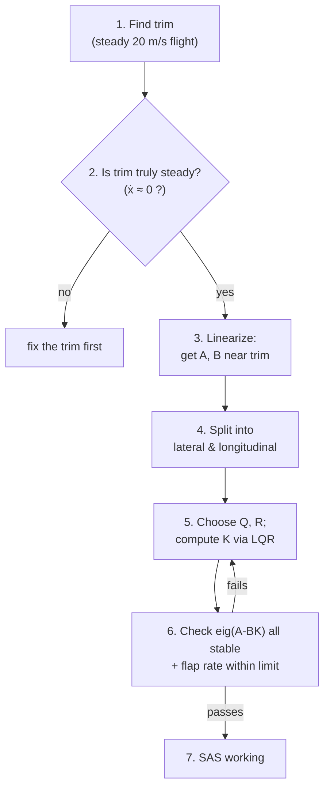
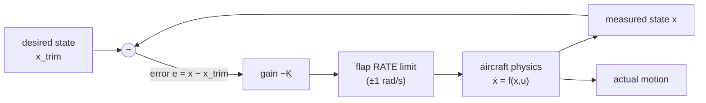
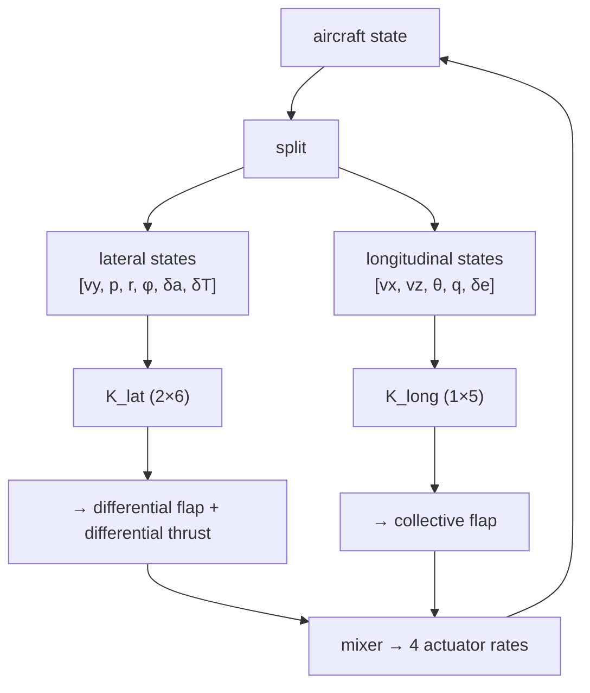

# The Theory Behind
### A from‑zero book on control theory, taught through one real flight‑control system

> This is **not** a guide to the repository. It is a **control‑theory book**.
> The aircraft in this project is only our *worked example* — a single, consistent
> story we return to again and again so that every abstract idea has something
> concrete to hold onto.
>
> **How to read this book.** Every chapter does the same three things, in order:
> **(1) intuition** in plain words and pictures, **(2) the idea made precise**
> with light math, **(3) the idea seen in our aircraft** with real numbers
> computed from the system. If a formula ever feels heavy, skip to the analogy —
> it carries the same meaning.
>
> All numerical values (poles, gains, angles) in this book were computed directly
> from the system's own dynamics, so the examples are real, not invented.

---

## Table of Contents
1. Executive Summary
2. Understanding System Dynamics (Intuition First)
3. Mathematical Modeling of the System
4. From System to Transfer Function
5. Poles, Zeros, and Eigenvalues
6. Plotting and Visualization
7. System Behavior Through Poles
8. Target Poles and Design Reasoning
9. Lateral vs Longitudinal Poles
10. Gain Calculation and Control Design
11. What Went Wrong (Theory Perspective)
12. Visual Explanations
13. Real‑World Analogies
14. Final Story — What Happened and Why
- Appendix A: A 10‑term glossary
- Appendix B: The real numbers, in one place

---

# 1. Executive Summary

**The system.** A small fixed‑wing aircraft (about the size and weight of a large
model airplane, 2.5 kg) flying straight and level at **20 metres per second**. We
have a *math model* of how it moves, and we want software that keeps it flying
**steadily** — not wobbling, not tumbling — even when a gust knocks it off course.

**The control problem it solves.** Left alone, this aircraft is **not naturally
steady**. We will see, with real numbers, that one of its natural motions
literally *grows* over time — a slow tumble waiting to happen. The job of the
controller (called a **Stability Augmentation System**, or **SAS**) is to watch
the aircraft's motion and continuously nudge the wing flaps and motors to cancel
that instability. This is the classic problem of control theory: **make an
unstable or sloppy system behave the way we want.**

**The control problem it aims to solve next.** Two bigger goals sit on the horizon:
- **Navigation/estimation** — figuring out the aircraft's attitude from *noisy*
  sensors (an unfinished part of the project), and
- **Guidance** — deciding *where to go* (not started).

This book focuses on the part that is **done and working**: stabilizing the
aircraft. That single achievement contains almost every core idea in introductory
control theory — stability, poles, damping, feedback, gains, and tuning — so it is
the perfect teaching example.

---

# 2. Understanding System Dynamics (Intuition First)

## 2.1 What is a "dynamic system"? (no equations yet)

A **dynamic system** is anything whose *future depends on its present*. Push it,
and it doesn't just instantly jump — it *evolves*. A cup of coffee cooling down, a
swing set after you let go, a car rolling after you lift off the gas: all dynamic
systems. The key word is **memory**. The system "remembers" where it is and keeps
moving from there.

Our aircraft is a dynamic system. If it's pitched nose‑up right now and rolling
slightly left, *that* is its present condition, and physics will carry it forward
from exactly there.

## 2.2 Inputs, outputs, and states — the three words you need

Picture driving a car:

- **Input** = what *you* control. The steering wheel, the gas pedal. In the
  aircraft: the **wing flaps** (called *elevons*) and the **motor thrust**.
- **State** = the *complete current condition* of the system — everything you'd
  need to know to predict what happens next. For the car: its position, speed,
  and heading. For the aircraft: where it is, which way it points, how fast it
  flies, and how fast it's rotating.
- **Output** = what you *measure or care about*. For the car: maybe just "am I
  staying in my lane?" For the aircraft: its roll and pitch angles.

> **The one‑sentence model of control:** *you choose **inputs**, the **state**
> evolves according to physics, and you watch the **outputs** to decide your next
> input.* That loop — measure, decide, act, repeat — is the entire game.

## 2.3 The balancing‑stick analogy (remember this — we use it all book)

Balance a broomstick upright on your open palm. This tiny act contains all of
control theory:

```
        | <- the stick wants to fall (it is UNSTABLE)
        |
       \|/ <- your hand moves to catch it (your INPUT)
   -----o-----  your palm
```

- The **state** is the stick's lean angle and how fast it's leaning.
- Your **eyes** are the *sensor*; your **brain** is the *estimator*; your **hand**
  is the *controller*.
- Crucially: **left alone, the stick falls.** It is *naturally unstable*. Only
  your constant correcting keeps it up.

Our aircraft is like that stick: one of its natural motions tends to grow, and the
SAS is the "hand" that keeps catching it. Hold this picture — we will return to it
in nearly every chapter.

## 2.4 Why "steady flight" is not automatic

You might think an airplane just flies straight on its own. Some do, somewhat. But
many real aircraft have natural wobbles, and some have motions that *worsen* on
their own. Our aircraft has a side‑to‑side wobble (called *dutch roll*) that, in
this model, slowly **grows** rather than dies out. That is exactly why a
controller is needed — and exactly the situation control theory was invented for.

---

# 3. Mathematical Modeling of the System

Now we make the intuition precise — gently.

## 3.1 The state vector: bundling "everything about right now" into a list

The aircraft's complete condition is captured by **16 numbers**, stacked into a
column we call the **state vector** `x`:

```
x = [ position (3) | attitude angles (3) | velocity (3) | rotation rates (3) | thrusts (2) | flap angles (2) ]
```

Why 16? Because to predict the future you need: where it is, which way it points,
how fast it moves, how fast it spins, and the current settings of its motors and
flaps. Miss any of these and you can't predict the next instant. That "minimum
complete description" *is* the state.

The **input vector** `u` has **4 numbers** — and here is a subtle, important point
we will revisit: the inputs are the *rates of change* of the flaps and motors
(how fast we move them), not their positions:

```
u = [ rate of motor 1, rate of motor 2, rate of flap 1, rate of flap 2 ]
```

## 3.2 The governing equation, in one symbol

All of physics for this aircraft is bundled into a single function `f`:

$$\dot{x} = f(x, u)$$

Read aloud: *"the rate of change of the state (`ẋ`, pronounced ex‑dot) equals some
function `f` of the current state and the current input."* That's it. Give `f`
where you are (`x`) and what you're doing (`u`), and it tells you which way the
state is heading next. The simulator's job is to keep integrating this — taking
tiny steps forward — to play the motion forward in time.

The function `f` here contains real aerodynamics: lift, drag, gravity, thrust, and
the swirling Newton's‑law rotations of a rigid body. It is **nonlinear** (curvy),
which matters in the next step.

## 3.3 The state‑space idea (the big simplification)

Nonlinear physics is hard to design against. But here's a beautiful fact:

> **Near a steady operating point, almost any smooth system behaves like a simple
> linear one.**

Think of a curved hillside. Zoom in close to one spot, and the curve looks like a
flat ramp. Control engineers do exactly this: pick a steady flight condition
(called **trim** — straight level flight at 20 m/s), then approximate the curvy `f`
by a *straight‑line* model valid *near* trim:

$$\dot{x} \approx A\,x + B\,u$$

- `A` is a matrix describing how the system drifts **on its own** (the open‑loop
  physics).
- `B` is a matrix describing how strongly your **inputs** push the state.

This is the famous **state‑space model**. `A` and `B` are just tables of numbers.
In our project they are found numerically: nudge each state a hair, see how `ẋ`
changes, and record the slope. (This is literally a numerical derivative — the
same "rise over run" you learned in calculus, done for every state.)

> **Why this matters:** once we have `A` and `B`, the entire toolbox of linear
> control theory — poles, stability, feedback gains — becomes available. Chapters
> 4–10 are all about what `A` and `B` tell us and how to use them.

---

# 4. From System to Transfer Function

## 4.1 The intuitive idea: "if I wiggle the input, how does the output wiggle?"

Imagine pushing a child on a swing. You push at some rhythm (input); the swing
responds with some motion (output). A **transfer function** is a compact
description of *how inputs turn into outputs* — specifically, how the system
amplifies, delays, or filters different "speeds" of input.

A useful mental model: the transfer function is the system's **personality
profile**. Hit it with a sudden shove and it tells you whether the system
responds sluggishly, snappily, with a ring, or with a runaway.

## 4.2 Why engineers like transfer functions

Two reasons:
1. They turn calculus (differential equations) into **algebra**. Loops of
   "rate of change of rate of change…" become simple multiplication and division.
2. They expose the system's **poles and zeros** (next chapter) — the handful of
   numbers that decide *everything* about its behavior.

## 4.3 The Laplace transform — conceptually only

Here is the only thing you need to feel about the **Laplace transform**: it is a
mathematical "translator" that converts *time‑domain* statements ("the angle
changes at this rate") into *algebra* in a new variable called **s**. The symbol
`s` secretly means "rate of change" (a derivative). So a differential equation
like

$$\dot{x} = a\,x + b\,u$$

becomes, after the translation,

$$s\,X(s) = a\,X(s) + b\,U(s)\quad\Rightarrow\quad \frac{X(s)}{U(s)} = \frac{b}{s - a}.$$

That last fraction **is** a transfer function. The bottom (denominator) being zero
— here `s = a` — is a **pole**. Hold that thought; it's the star of Chapter 5.

## 4.4 How *our* system relates to transfer functions

Honest note, tied to the real project: our aircraft has **many inputs and many
states** (it is "MIMO" — multiple‑input, multiple‑output). For such systems,
engineers usually work directly with the **state‑space** matrices `A`, `B` rather
than a single transfer function, because the **eigenvalues of `A`** play exactly
the same role as the poles of a transfer function (Chapter 5 explains this
equivalence). That is why the project computes `eig(A)` and never writes a literal
transfer function: **for state‑space systems, the eigenvalues of `A` *are* the
poles.** The transfer‑function picture is still the right *intuition* — it's just
that with 16 states we keep the information in matrix form.

If you *did* isolate one channel — say, "flap angle in, pitch angle out" — you
would get an ordinary transfer function with its own poles and zeros, and those
poles would be a subset of `eig(A)`. We'll lean on that single‑channel picture
whenever it helps.

---

# 5. Poles, Zeros, and Eigenvalues

This is the heart of the book. Three words, one shared idea.

## 5.1 Poles

### Intuition
A **pole** is a number that describes **one natural motion** of the system — a
"mode" it likes to move in, all by itself, with no input. Each pole answers two
questions about that motion:
- **Does it grow or die out?** (stability)
- **Does it oscillate, and how fast?** (ringing)

A pole is generally a **complex number**, `σ + jω`:
- `σ` (the real part) → **growth/decay**. Negative = dies out (good). Positive =
  grows (bad). Zero = neither (borderline).
- `ω` (the imaginary part) → **oscillation frequency**. Bigger = faster wobble.
  Zero = no wobble, just a smooth rise or decay.

```
            jω (oscillation)
             ^
   STABLE    |    UNSTABLE
 (decays)    |   (grows)
             |
 ------------+------------> σ (growth/decay)
   LEFT      |   RIGHT
 half-plane  | half-plane
             |
   "good"    |   "bad"
```

> **The single most important rule in this book:**
> **All poles in the LEFT half‑plane (negative real part) ⟺ the system is stable.**
> One pole sneaks into the right half‑plane ⟺ something will grow ⟺ trouble.

### Effect on stability
- Pole at `−2` → a motion that decays (halves every fraction of a second). Stable.
- Pole at `+0.3` → a motion that *grows* slowly. Unstable — a slow tumble.
- Poles at `−1 ± 6j` → a motion that **oscillates** (because of the `±6j`) while
  **decaying** (because of the `−1`). A damped ring. Stable and well‑behaved.

## 5.2 Zeros

### Intuition
If poles are about the system's *natural motions*, **zeros** are about *how an
input fails to reach an output*. A zero is a "speed" of input that the system
**blocks** — at that particular input rhythm, the output barely responds.

### Effect on response
Zeros don't change *whether* the system is stable, but they shape the *transient*
— the wiggle right after a disturbance. A zero in the wrong place can cause the
output to first move the **wrong way** before correcting (called *undershoot* or
*non‑minimum‑phase* behavior). Real example you've felt: backing up a car with a
trailer — turn the wheel one way and the trailer first goes the *other* way.

### In our system
The project's control design uses **state feedback**, which targets **poles
(eigenvalues)** directly and does not explicitly compute zeros. So zeros are not a
front‑line character in this particular story — but you should know they exist and
that they sculpt the *shape* of the response, while poles decide its *stability
and speed*. *(This is a directly relevant honesty note: the repo never computes
zeros; it works entirely with eigenvalues.)*

## 5.3 Eigenvalues — the same thing, wearing a matrix hat

### Intuition
For a state‑space system `ẋ = A x`, an **eigenvalue** of the matrix `A` is a
number `λ` for which there's a special direction (an **eigenvector**) where the
system moves *purely along that direction*, growing or shrinking like `e^{λt}`.

That phrase `e^{λt}` is the whole story:
- if `λ` is negative → `e^{λt}` shrinks → mode decays;
- if `λ` is positive → `e^{λt}` blows up → mode grows;
- if `λ` is complex → `e^{λt}` spirals → mode oscillates.

### Connection to poles
> **The eigenvalues of `A` ARE the poles of the system.** Same numbers, same
> meaning. "Pole" is the transfer‑function name; "eigenvalue" is the matrix name.

This is why our project, working in state space, simply computes `eig(A)` and
reads off stability. When you see the code call `eig(...)`, mentally translate it
to "find the system's natural motions and check if any of them grow."

---

# 6. Plotting and Visualization

The natural home for poles/eigenvalues is the **complex plane**: real part across,
imaginary part up. Engineers stare at this plot constantly because *the location
of each dot tells the whole behavior of one mode.*

## 6.1 Our aircraft's OPEN‑LOOP poles (no controller yet)

These are real numbers computed from the system at trim.

**Longitudinal (front‑to‑back motion) poles:**
`−19.51`, `−7.70`, and `−0.019 ± 0.503j`.

**Lateral (side‑to‑side motion) poles:**
`+0.265 ± 6.82j`, `−3.099`, and `+0.132`.

Plotted (each `★` is a pole; the vertical line is the stability boundary):

```
        jω
         ^
   +6.82 |                      ★         <-- dutch roll: OSCILLATES (±6.82)
         |                                    and GROWS (+0.265) = UNSTABLE
         |
   +0.50 |        ★                       <-- phugoid: barely damped (-0.019)
         |
 --------+--------|----------------|----> σ
  -19.5  -7.7   -3.1  -0.02  0  +0.13 +0.27
         |        ★ (phugoid)
         |
   -0.50 |        ★
         |
   -6.82 |                      ★
         |
   ★(-19.5)  ★(-7.7)  ★(-3.1)        ★(+0.13)  <-- on the real axis
         |          (stable)      (slightly UNSTABLE: spiral)
   LEFT (good)      :   RIGHT (bad)
```

**What this picture screams at a trained eye:** two poles are on the **wrong
(right) side** — `+0.265 ± 6.82j` (a fast growing wobble) and `+0.132` (a slow
growing drift). **This aircraft is unstable on its own.** That is the entire
justification for building a controller.

## 6.2 The same plot, after the controller (closed loop)

After the SAS is added (Chapter 10), every pole is dragged into the left
half‑plane:

```
        jω
         ^
   +11   |        ◆ ◆        <-- fast lateral modes, now DAMPED & stable
         |
    +5.5 |   ◆                <-- longitudinal, damped
         |
 --------+------------------|----> σ      (NOTHING to the right of 0 now)
  -19.6 -10 -9.3 -7.7 -6.2 -2.3 -0.7   0
         |
    -5.5 |   ◆
         |
   -11   |        ◆ ◆
         | ALL poles LEFT of the line  => STABLE
```

**Before:** dots straddling the line (unstable). **After:** every dot safely left
(stable). This single before/after picture is the whole achievement of the
project, in one image.

---

# 7. System Behavior Through Poles

Each pole location maps to a *felt* behavior. Here is the decoder ring, then we
apply it to our aircraft.

| Pole location | Behavior | Felt as |
|---|---|---|
| Far left, real (e.g. `−19.5`) | Very fast decay | A motion that vanishes almost instantly |
| Near‑zero, real, negative (`−0.7`) | Slow decay | A lazy drift back to steady |
| **Positive real (`+0.13`)** | **Slow growth** | **A drift that won't stop — instability** |
| Complex, negative real part (`−1 ± 6j`) | Damped oscillation | A wobble that rings then settles |
| **Complex, positive real part (`+0.27 ± 6.8j`)** | **Growing oscillation** | **A wobble that gets worse — instability** |
| Pure imaginary (`0 ± ωj`) | Sustained oscillation | Endless ringing, never settles |

### The four behaviors you must recognize

1. **Stability** — *do disturbances die out?* Decided purely by the **real parts**.
   All negative ⇒ stable. Our open‑loop aircraft fails this (two positive reals).
2. **Oscillation** — *does it wobble?* Caused by the **imaginary parts**. Our
   dutch‑roll wobbles at about `6.8` rad/s (≈ one wobble per second).
3. **Damping** — *how quickly does a wobble settle?* It's the *ratio* of the real
   part to the total distance from the origin. A pole like `−0.019 ± 0.503j` is
   **barely damped** (real part tiny compared to the `0.5` wobble) — it rings for a
   very long time. This is our aircraft's **phugoid** (a slow speed/altitude
   bobbing). A pole like `−7.7 ± 5.6j` is **well damped** — it settles in a wobble
   or two.
4. **Response speed** — *how fast does anything happen?* The **distance of the pole
   from the origin**. The `−19.5` pole is lightning‑fast; the `−0.7` pole is
   leisurely.

> **Tie‑back:** the project's commit history literally moves from *"almost works"*
> to *"SAS working."* In pole language, that is the story of dragging the
> `+0.265 ± 6.82j` and `+0.132` dots from the right half‑plane to the left.

---

# 8. Target Poles and Design Reasoning

## 8.1 What "target poles" means

Designing a controller can be thought of as **choosing where you want the
closed‑loop poles to end up**, then computing the feedback that puts them there.
You are, in effect, *prescribing the personality* of the controlled aircraft.

## 8.2 The trade‑offs (there is no free lunch)

Where should you put the poles? Three competing desires pull at you:

- **Speed** (push poles far left) → fast recovery from gusts. *But* fast poles
  demand **large, quick control motions**.
- **Stability margin / damping** (keep poles comfortably left, well‑damped) →
  smooth, ring‑free recovery. *But* too conservative feels sluggish.
- **Overshoot / effort** → aggressive poles make the flaps slam around and can
  cause the aircraft to overshoot its target before settling.

The fundamental tension:

```
   Slow & gentle  <---------------------->  Fast & aggressive
   - lazy recovery                          - snappy recovery
   - tiny control effort                    - HUGE control effort
   - very stable                            - risk of overshoot / hitting limits
```

## 8.3 The hidden constraint that dominates everything: actuator limits

Here is the lesson this project learned the hard way (Chapter 11): **you can ask
for fast poles, but the flaps can only physically move so fast.** The aircraft's
elevons are limited to **1 radian per second** of motion. If your chosen poles
demand the flap move at *20* rad/s, the flap **saturates** (maxes out), the
controller temporarily loses authority, and a fast unstable mode escapes.

> **Design reasoning, distilled:** choose poles fast enough to tame the
> instability, but slow enough that the *real, physical actuator* can keep up. The
> project ultimately stopped hand‑picking pole locations and instead used a method
> (LQR, Chapter 10) that **automatically balances performance against effort.**

## 8.4 What the design goal likely was

Reading the chosen weightings in the code, the goal was: **firmly stabilize both
the fast lateral wobble and the lazy longitudinal bobbing, while keeping flap
motion gentle.** The closed‑loop poles that resulted —
`−0.7 ± 0.9j` (longitudinal) and `−2.3, −6.2 ± 10.3j, ...` (lateral) — show exactly
that: all comfortably stable, reasonably damped, and (critically) achievable
within the 1 rad/s flap limit.

---

# 9. Lateral vs Longitudinal Poles

## 9.1 Why split an aircraft into two halves?

Aircraft motion separates almost perfectly into two nearly‑independent families.
This is a gift: instead of one tangled 16‑dimensional problem, we solve two small,
clean ones.

- **Longitudinal motion** = the **side view** of flight: pitching the nose up/down,
  speeding up/slowing down, climbing/descending. Think of a porpoise diving and
  surfacing. Controlled by the **collective elevon** (both flaps moving together,
  like an elevator).

- **Lateral motion** = the **rear/front view**: rolling left/right, yawing
  left/right, sliding sideways. Think of a car drifting and steering. Controlled by
  the **differential elevon** (flaps moving oppositely, like ailerons) and
  **differential thrust** (one motor harder than the other, for yaw).

```
   LONGITUDINAL (side view)            LATERAL (front view)
        nose up                          roll left   roll right
         ___                                \           /
        /   \___                             \    ^    /
   ~~~~/        \___  climb/dive          -----[plane]-----
       speed up / slow down                    yaw  &  sideslip
```

## 9.2 The named natural modes (real‑world meaning)

Each family has characteristic "modes," and our computed poles match the textbook
names:

**Longitudinal modes:**
- **Short‑period** (`−7.70`, and the controlled `−7.7 ± 5.6j`): a quick nose
  bobble — fast, usually well behaved. *Analogy: tap the nose, it bobs once and
  settles.*
- **Phugoid** (`−0.019 ± 0.503j`): a *slow*, lightly‑damped trade between speed
  and altitude — the aircraft gently bobs up‑slow, down‑fast over many seconds.
  *Analogy: a roller coaster of energy sloshing between height and speed.* Its
  near‑zero real part means it rings for a long time — a classic thing a
  controller improves.

**Lateral modes:**
- **Dutch roll** (`+0.265 ± 6.82j`): a coupled roll‑and‑yaw wag, like a fish
  swimming or a car fishtailing. **In our model it is unstable (positive real
  part)** and fast (≈1 Hz) — the single most dangerous pole in the system.
- **Roll/spiral** (`−3.099` and `+0.132`): how quickly a bank angle builds or
  decays. The slightly **positive** `+0.132` is a gentle **spiral instability** —
  left alone the aircraft slowly tightens into a descending turn. *Analogy: a
  shopping cart that, released, slowly veers more and more to one side.*

## 9.3 Why this split matters for the controller

Because the two families barely interact near trim, the project designs **two
separate controllers** — one lateral (`K_lat`), one longitudinal (`K_long`) — and
lets them run side by side. Smaller problems, clearer reasoning, easier tuning.
This is a recurring theme in engineering: *divide a hard problem along its natural
seams.*

---

# 10. Gain Calculation and Control Design

## 10.1 What is a "gain"? (the intuition)

A **gain** is simply *how hard you react to an error*. High gain = react strongly
to small errors; low gain = react gently. When you balance the broomstick, your
"gain" is how big a hand‑motion you make for a given amount of lean.

In math, the controller is a **feedback law**:

$$u = -K\,(x - x_{\text{trim}})$$

Read it as: *"the input `u` is minus a gain `K` times how far the state `x` is from
where we want it (`x_trim`)."* The minus sign means **push back against the
error** — that's the essence of *negative feedback*, the most important idea in
all of control. The matrix `K` is a table of gains, one per state.

Our actual longitudinal gain row, computed from the system, is:

```
K_long = [ -0.241,  -0.043,   3.408,   0.153,   9.186 ]
           (vx)     (vz)     (theta)    (q)     (delta_e)
```

The big `3.408` on `theta` says *"react firmly to pitch‑angle error,"* and the
`9.186` on the flap state keeps the flap itself well‑behaved. Each number is a
reflex strength for one piece of the state.

## 10.2 How gains "shift poles" (the magic, intuitively)

Here is the central trick of control design. Recall the open‑loop physics:

$$\dot{x} = A\,x.$$

Now apply feedback `u = −Kx` through the input matrix `B`:

$$\dot{x} = A\,x + B\,u = A\,x - B\,K\,x = (A - BK)\,x.$$

Look what happened: the system's "personality matrix" changed from `A` to
**`A − BK`**. Its **eigenvalues (poles) move!** By choosing `K`, you *reshape the
matrix* and therefore *relocate the poles* — dragging those dangerous
right‑half‑plane dots over to the safe left side.

> **This is the whole idea of control by feedback:** you cannot change physics
> (`A`) or the plane's build (`B`), but you *can* choose how you react (`K`), and
> that reaction literally rewrites the system's natural motions.

## 10.3 How tuning works — two philosophies

**Philosophy 1 — Pole placement.** *"I'll name exactly where I want the poles, and
solve for the `K` that puts them there."* Direct and intuitive. **Catch:** when
there are several inputs, *infinitely many* different `K`'s give the same poles,
and they differ wildly in how violently they move the flaps. You can accidentally
pick a `K` that's mathematically "correct" but physically reckless.

**Philosophy 2 — LQR (Linear Quadratic Regulator).** Instead of naming poles, you
name **what you care about**: a penalty `Q` on state errors (how much you dislike
being off‑target) and a penalty `R` on control effort (how much you dislike moving
the flaps hard). LQR then computes the **one unique** `K` that best balances them.
Crank `R` up and the controller becomes gentle; crank `Q` up and it becomes
aggressive.

```
   minimize over all time:   ∫ ( xᵀ Q x  +  uᵀ R u ) dt
                                 \_____/    \_____/
                              "stay on target"  "don't thrash the flaps"
```

The project uses LQR with `R = 10` (a firm penalty on flap effort). The result: a
controller that stabilizes the aircraft while commanding only gentle flap motion —
about **0.07 rad/s**, far inside the 1 rad/s limit. *That single choice is what
turned a diverging design into a working one.*

## 10.4 Putting it together — the design recipe used



---

# 11. What Went Wrong (Theory Perspective)

Real control design is a sequence of *theory lessons learned by failure*. This
project hit four, each illuminating a core concept. We tell each as **symptom →
theory → cure**.

## 11.1 "The controller assumed it could set positions, but it could only set speeds"

- **Symptom:** the design looked stable on paper but the real loop tumbled.
- **Theory:** the controller was designed as if its command *was* the flap angle.
  But physically, the command is the flap *rate* — there is an extra **integrator**
  between command and effect (rate must be integrated to get position). An
  integrator is itself a pole at the origin. The design ignored a whole pole, so
  the model it verified was **not** the model it ran. *(Lesson: design on the
  system you actually implement.)*
- **Cure:** include the flap as a **state** in the design model, so the
  integrator is accounted for.

## 11.2 "The 'steady' flight wasn't steady"

- **Symptom:** even with no disturbance, the aircraft rolled off; controlled, it
  drifted then grew.
- **Theory:** **linearization is only valid about a true equilibrium** — a point
  where `ẋ = 0`. The chosen trim had a leftover rolling moment (a small built‑in
  asymmetry in the aerodynamics) producing **7.14 rad/s² of uncommanded roll**. So
  the flat‑ramp approximation was taken on a *slope*, and the matrix `A` described
  a fiction. *(Lesson: verify `ẋ ≈ 0` before you linearize.)*
- **Cure:** trim the roll axis too (set the two flaps slightly unequal), driving
  the residual from 7.14 down to ≈ 0, and add an automatic check.

## 11.3 "The controller slowly undid its own trim"

- **Symptom:** stable for ~5 seconds, then a growing wobble appeared from nowhere.
- **Theory:** a pure proportional controller drives its input **to zero**. But the
  steady‑flight flap setting was *not* zero (it had that small anti‑roll offset).
  Without telling the controller the correct target, it slowly erased the offset,
  re‑awakening the instability. This is **steady‑state error**: proportional
  feedback alone cannot hold a nonzero set‑point. *(Lesson: feed‑forward the trim,
  or add integral action.)*
- **Cure:** subtract the known trim value so the controller regulates *to the
  trim*, not to zero.

## 11.4 "The math was stable, the physics was not"

- **Symptom:** the same control law was stable in one math tool and divergent in
  another.
- **Theory:** two ideas collided. First, **pole placement is non‑unique for
  multi‑input systems**, so different tools produced different (equally
  "correct") gains. Second, the aggressive gain demanded flap rates of ~20 rad/s
  against a **1 rad/s physical limit** — **actuator saturation**. While the flap is
  pinned at its limit, the loop is effectively *open*, and the fast unstable
  dutch‑roll escapes. **A linear stability check cannot see saturation**, because
  saturation is nonlinear. *(Lesson: a linearly stable design can still fail in
  reality; always check commanded effort against real limits.)*
- **Cure:** switch from pole placement to **LQR with a control‑effort penalty
  (`R = 10`)**, yielding a unique, reproducible gain that commands gentle
  (~0.07 rad/s) flap motion — comfortably within limits.

> **The unifying theme of all four:** *theory only protects you if your model
> tells the truth.* Wrong input definition, wrong equilibrium, wrong set‑point,
> ignored limits — each was a place where the math was fine but the *model* lied.

---

# 12. Visual Explanations

## 12.1 The negative‑feedback control loop



*Read it as a loop:* compare where you are to where you want to be → react with
gain `−K` → the reaction passes through a physical rate limit → it moves the
aircraft → measure again → repeat.

## 12.2 Block diagram of the two‑channel SAS



## 12.3 Pole migration (before → after), conceptual

```
        jω                                jω
         ^   BEFORE (open loop)            ^   AFTER (LQR closed loop)
   +6.8  |        ★ (unstable wobble)  +11 |    ◆ ◆
         |                                 |
 --------+--+----> σ                -------+------> σ
       0 | +0.13 +0.27 (unstable)          | (all left of 0)
   -6.8  |        ★                   -11  |    ◆ ◆
         |
   two dots on the RIGHT  ====>  every dot on the LEFT
```

## 12.4 Response sketches (what you'd see on a plot)

```
 Disturbance response of ROLL angle φ

 UNSTABLE (open loop)        WORKING (LQR closed loop)
   /\      /\    /\            \
  /  \    /  \  /  \            \___
 /    \  /    \/    \  ...           \________  ~ back to 0 in ~2 s
      \/                        no growth, gentle return
 grows every cycle
```

---

# 13. Real‑World Analogies (every big idea, in everyday terms)

| Control idea | Everyday analogy |
|---|---|
| **Dynamic system / state** | A rolling shopping cart — its future depends on its current speed and heading (its state). |
| **Input vs output** | Driving: steering wheel = input, staying in lane = output. |
| **Equilibrium / trim** | A marble resting at the bottom of a bowl — undisturbed, it stays. |
| **Instability (right‑half‑plane pole)** | A marble balanced on top of a dome — the slightest nudge and it runs away. (Our dutch roll.) |
| **Damping** | Car suspension over a bump: good = settles in one bounce; poor = bounces for a while (our lightly‑damped phugoid). |
| **Oscillation (imaginary part)** | A plucked guitar string — it vibrates at a frequency set by the imaginary part. |
| **Negative feedback / gain** | A **thermostat**: the colder the room vs the set‑point, the harder it heats. Gain = how aggressively it reacts. |
| **Pole placement vs LQR** | Two drivers reaching the same exit: a jerky one who slams the wheel (aggressive pole placement) vs a smooth one who makes small efficient corrections (LQR). |
| **Actuator saturation** | A steering wheel that can only spin so fast — in a violent skid, demanding an impossible correction just pins it at the limit while the car keeps sliding. |
| **Steady‑state error** | Holding a spring‑loaded door open: you must keep pushing (feed‑forward the trim); if you only react to motion, it drifts shut (our flap drifting off trim). |
| **Cruise control** | Set 100 km/h on a hill: a proportional‑only system settles a bit *below* 100 (steady‑state error) — exactly why integral/feed‑forward terms exist. |
| **Balancing stick** | The whole project in miniature: an unstable thing kept upright by constant sensing and correcting. |

---

# 14. Final Story — What Happened and Why

**What was being built.** A "reflex" for a small fixed‑wing aircraft — a Stability
Augmentation System that keeps it flying straight and level at 20 m/s without
wobbling or tumbling, even when bumped. In control‑theory terms: take a system
with poles on the *wrong* side of the stability line and, using feedback, drag
every pole to the *right* (left!) side.

**How it behaved at first.** Badly — and instructively. The aircraft's own physics
contained two unstable natural motions: a fast side‑to‑side **dutch roll**
(`+0.27 ± 6.8j`) that grows while it wobbles, and a slow **spiral** (`+0.13`) that
quietly tightens into a descending turn. Any honest model of this aircraft *must*
diverge without control. That was never in doubt; the question was whether the
controller could fix it.

**What went wrong, and why — through the lens of theory.** Four times the design
"looked stable" yet the simulation diverged, and each time the culprit was a
**model that didn't tell the truth**:
1. The controller treated its command as a flap *angle* when it was really a flap
   *rate* — an **ignored integrator**, so the verified poles weren't the real
   poles.
2. The "steady" flight point wasn't an **equilibrium** (a leftover rolling moment),
   so the linear model was taken on a slope and described a fiction.
3. The controller, being proportional, drove its flaps **to zero** instead of to
   the correct nonzero trim — **steady‑state error** that slowly re‑lit the
   instability.
4. The chosen gains demanded flap motion **20× faster than physically possible** —
   **actuator saturation**, a nonlinear effect invisible to the linear stability
   check.

Notice the pattern: in every case the *mathematics of stability was applied
correctly*; what failed was the **fidelity of the model** the mathematics ran on.
That is the deepest lesson in the whole project, and arguably in all of applied
control: **`eig(A−BK)` is only as trustworthy as `A`, `B`, the input definition,
the equilibrium, and the physical limits behind them.**

**What was learned.**
- **Stability lives in the poles** — and you can *move* the poles with feedback
  (`A → A − BK`). That's the superpower of control.
- **A linearly stable design can still die in reality** if it ignores actuator
  limits. Always check that the *effort* you command is physically possible.
- **For multi‑input systems, prefer LQR over hand‑placed poles** — it gives a
  unique, effort‑aware, reproducible gain, and the effort penalty `R` is your
  direct dial for "don't thrash the actuators."
- **Verify the equilibrium and the set‑point**, not just the eigenvalues. Most of
  the failures were upstream of the control math entirely.

**What is now better.** With the input defined correctly (flap as a state), a true
equilibrium (roll trimmed out), the trim fed forward, and LQR balancing
performance against gentle effort, the closed‑loop poles all sit safely in the
left half‑plane (`−0.7 ± 0.9j` longitudinally; `−2.3, −6.2 ± 10.3j, …` laterally).
The aircraft now recovers from a 5° disturbance in about two seconds with no
overshoot and tiny flap motion — the broomstick stays up. In the project's own
words, the journey went from *"it almost works now"* to **"SAS working."**

**What remains.** The "eyes and brain" of the system — estimating attitude from
noisy sensors (the Kalman filter) — is still unfinished, and a deeper idea waits
there: **observability** (can you even *see* a state from your sensors?). The same
weakly‑controlled yaw axis we met here reappears as an *unobservable* yaw in the
estimator. But that is the next book. For stabilizing flight — the first and most
fundamental control problem — the theory in these chapters is exactly what turned
a tumbling model into a steady one.

---

# Appendix A: A 10‑term glossary

| Term | One‑line meaning |
|---|---|
| **State** | The minimum set of numbers describing "right now." |
| **Equilibrium / trim** | A state where nothing changes if undisturbed (`ẋ = 0`). |
| **State‑space model `ẋ = Ax + Bu`** | The straight‑line approximation of physics near trim. |
| **Pole / eigenvalue** | A number describing one natural motion: grows/decays (real part), oscillates (imag part). |
| **Zero** | An input "speed" the system blocks; shapes the transient, not stability. |
| **Stability** | All poles in the left half‑plane (negative real parts). |
| **Damping** | How fast an oscillation settles (ratio of decay to wobble). |
| **Feedback gain `K`** | How hard the controller reacts to error; `u = −K(x − x_trim)`. |
| **Pole placement / LQR** | Two ways to choose `K`; LQR balances performance vs effort uniquely. |
| **Saturation** | An actuator hitting its physical limit — a nonlinear effect linear analysis misses. |

# Appendix B: The real numbers, in one place

*(Computed directly from the system at trim, V₀ = 20 m/s, α₀ ≈ 6.55°.)*

**Open‑loop poles (uncontrolled):**
- Longitudinal: `−19.51`, `−7.70`, `−0.019 ± 0.503j` (phugoid, barely damped).
- Lateral: `+0.265 ± 6.82j` (dutch roll, **unstable**), `−3.099`, `+0.132` (**spiral, slightly unstable**).

**Closed‑loop poles (LQR, all stable):**
- Longitudinal: `−19.56`, `−7.74 ± 5.56j`, `−0.705 ± 0.938j`.
- Lateral: `−2.29`, `−9.28`, `−10.05 ± 11.06j`, `−6.24 ± 10.25j`.

**Longitudinal gain** `K_long = [−0.241, −0.043, 3.408, 0.153, 9.186]`
(on states `[vx, vz, θ, q, δe]`).

**Design knobs:** LQR penalties `Q_long = diag([1,1,5,1,0.1])`, `R_long = 10`;
`Q_lat = diag([1,1,1,5,0.1,0.1])`, `R_lat = 10·I`.
**Result:** commanded flap rate ≈ **0.07 rad/s** vs the **1.0 rad/s** physical
limit — comfortably safe.

---

*End of "The Theory Behind."*
